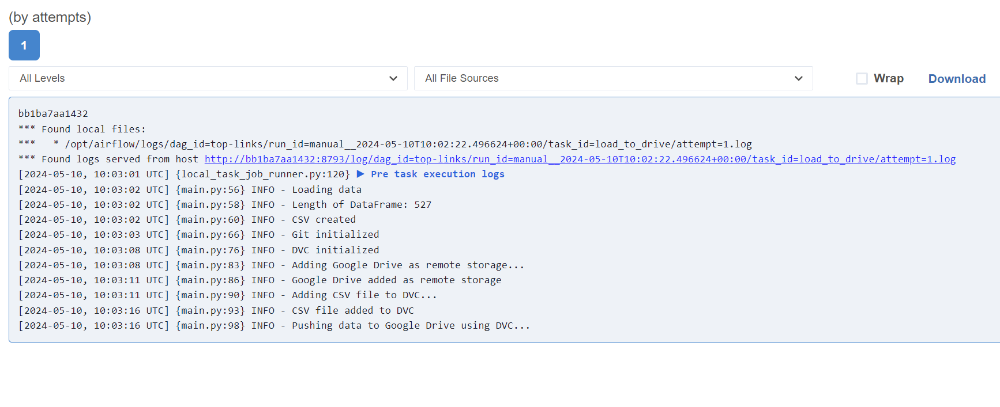

# Web Links Extraction Pipeline

## Overview
This project implements a data pipeline using Apache Airflow to extract top links from specified websites, transform the extracted data, and push it to Google Drive using Data Version Control (DVC). The pipeline is designed to run daily to ensure up-to-date data extraction and storage.

## Technologies Used
- **Python**: Programming language used for scripting tasks and data processing.
- **Requests**: Library for making HTTP requests to fetch web pages.
- **Beautiful Soup**: Python library for parsing HTML and XML documents.
- **Airflow**: Platform to programmatically author, schedule, and monitor workflows.
- **Pandas**: Library for data manipulation and analysis.
- **Git**: Version control system for tracking changes in project files.
- **DVC (Data Version Control)**: Version control system for managing large files and datasets.
- **Google Drive**: Cloud storage service used for storing extracted data.

## Project Structure
- **dag.py**: Defines the Airflow Directed Acyclic Graph (DAG) for the data pipeline.
- **README.md**: Documentation providing an overview of the project, its components, and instructions for setup and execution.
- **top_links.csv**: CSV file containing the extracted top links.
- **.gitignore**: Specifies intentionally untracked files to be ignored by Git.
- **airflow/**: Directory containing Airflow configurations and logs.
- **.dvc/**: Directory containing DVC configurations and metadata.

## Setup and Execution
1. **Clone Repository**: Clone this repository to your local machine.
   ```bash
   git clone https://github.com/Aeiman191/Web-links-Extraction.git
   ```

2. **Install Dependencies**: Install the required Python dependencies using pip.
   ```bash
   pip install requests beautifulsoup4 pandas airflow dvc 
   ```

3. **Initialize Airflow**: Set up Airflow following the official [documentation](https://airflow.apache.org/docs/apache-airflow/stable/start/local.html).

4. **Configuration**: Update the `sources` list in `dag.py` with the URLs of the websites from which you want to extract top links.

5. **Run DAG**: Start the Airflow scheduler and web server and trigger the `top-links` DAG.

6. **View Results**: After execution, check the `top_links.csv` file for the extracted top links.




## Contributors
- Aeiman Imtiaz

---

Feel free to customize this README to include additional details or instructions specific to your project. Let me know if you need further assistance!
